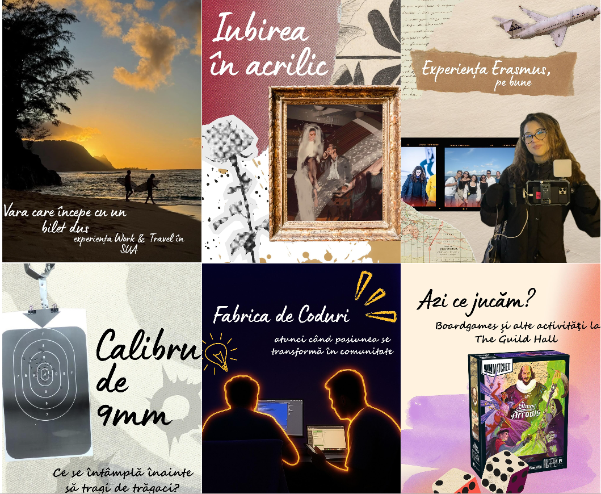

# Threads of peolpe
# Threads of pleople: Stories woven, thread by thread, with and about people

  

*A digital platform dedicated to soulful stories—something authentic, filled with longing and heart.*

---

## 1. The story 
> **"Digital product design starts from a problem experienced by real people in a real-life context."**

**Fire de Oameni** is not just a website; it is a "soul project" born from the desire to give a voice to even the most intimate experiences. Throughout the development of this project, I applied UCD principles, ensuring that the final product meets both the audience's needs and our strategic objectives.

### Vision and Strategy
According to the strategic plan, we defined clear directions:
*   **Product objectives:** Creating an authentic digital space for intimate stories about passions.
*   **Users needs:** Easy access to quality content, an intuitive navigation experience, and an aesthetic that inspires peace and creativity, while reflecting our visual preferences.

---

## 2. Design and user experience
This is the central component of the project. I placed a heavy emphasis on the Surface Plane and Information Architecture to create an immersive experience.

### Senzory design
I chose an approach that communicates emotion, not just information.
*   **Color palette:** Vibrant accent colors from the logo set against a high-contrast black and white background, following WCAG standards.
*   **Tipography:** I selected fonts that ensure readability and convey the brand's personality (Jua for the logo—fun and playful).

### Information architecture and navigation
The site structure is built to facilitate findability.
*   **Sitemap:** A clear hierarchical organization to help the user understand the context.
*   **Navigare:** An intuitive system using familiar, concise labels to guide the user effortlessly. It features two main article sections: **Body and soul** (Trup și suflet) and **Left home** (Plecat de acasă).

  

*Concept iterations*

---

## 3. Tehnical implementation

The project was developed using a modern technology stack for content management, focusing on performance and accessibility.

* **Platform:** [WordPress](https://wordpress.org/)
* **Theme:** Twenty Twenty-Two (a flexible block theme utilizing Full Site Editing).
* **Hosting:** Powered by [Hosterion](https://hosterion.ro/), a Romanian web hosting provider, ensuring low latency and local support.

### 📁 WordPress Post Dashboard
Details from the post management panel:

  

---

## 4. SEO and Analytics
To measure success and ensure visibility, I integrated specific performance monitoring strategies.

### SEO 
*   **Semantic structure:** Correct use of HTML tags for optimal indexing.
*   **Keywords:** Optimization for targeted keywords.
*   **Performanță:** Image optimization (alt text, descriptions).

### Analytics and Metrics
I monitor **evaluation metrics** to validate the achievement of our goals:
*   **Traffic:** Number of unique and returning visitors, **1,300 in 3 months**.
*   **Engagement:**Average session duration and a bounce rate of **48.12**.
*   **Posts:** 19 articles have been published to date (end late january).  

---

## Contact and Social
*   **Website:** [firedeoameni.eu](https://firedeoameni.eu/)
*   **Authors:** Cherciu Alexia-Andreea and Fuiorea Iulia.
*   **LinkedIn/Social:** [firedeoameni](https://www.instagram.com/firedeoameni/)

## Online presence
*   **Imagery:** Our Instagram account reflects our concept in a unified manner.Each post follows a predetermined template.

  
  

